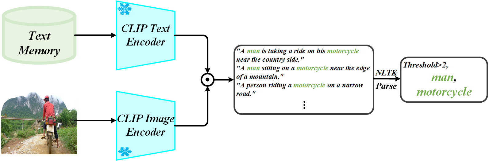
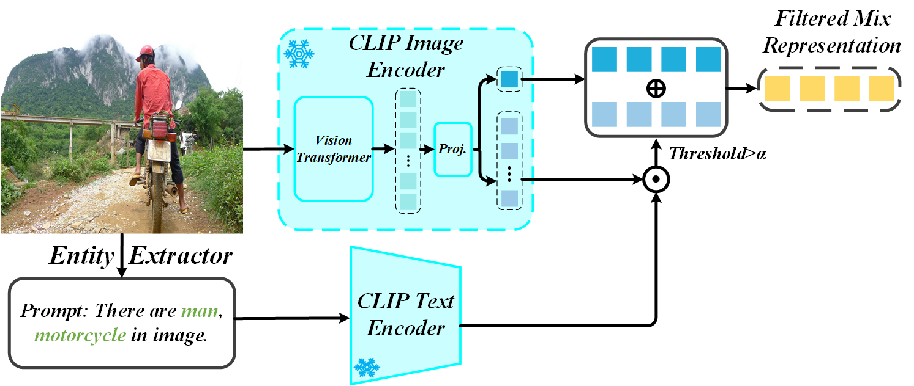
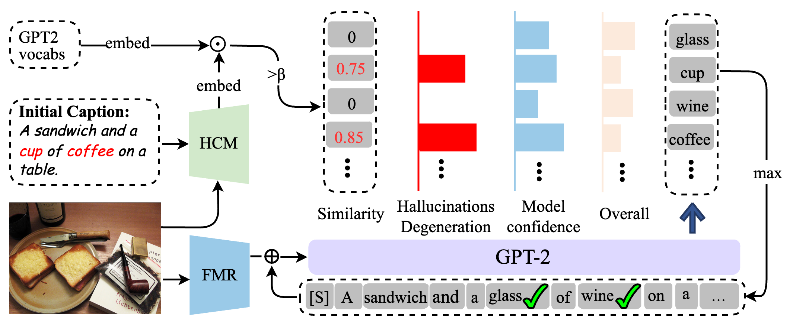

# FMR & HD (CVPR2025 Submission)

## Methods' framework
1. **Entitiy Extractor**

2. **Filtered Mix Represetation**

1. **Hallucination Degeneration**

---

### Conda environment
```bash
conda create -n env python=3.9
conda activate env
pip install -r requirements.txt
```

### Data preparation
Download annotations, evaluation tools, and best checkpoints.
```
bash scripts/download.sh
```

For COCO,
```
# place your coco images in annotations/coco/val2014

# Text retrieval
python src/image_like_retrieval.py

# Extract all entities
python src/entity_extractor.py # with IDX=0
```

For Flickr30k,
```
# place your flickr30k images in annotations/flickr30k/flickr30k-images

# Text retrieval
python src/image_like_retrieval.py --domain_source flickr30k --domain_test flickr30k --L 7

# Extract all entities
python src/entity_extractor.py # with IDX=1
```

For NoCaps,
```
# download images of NoCaps validation
# In my case, it took about 2 hours.
cd annotations/nocaps/
python download.py 

# Text retrieval
python src/image_like_retrieval.py --test_only --domain_test nocaps --L 7
```

## Training and Inference

```
Please Follow the original paper and their repo.
```

## Citation
If you use this code for your research, please cite:
```
@article{lee2024ifcap,
  title={IFCap: Image-like Retrieval and Frequency-based Entity Filtering for Zero-shot Captioning},
  author={Lee, Soeun and Kim, Si-Woo and Kim, Taewhan and Kim, Dong-Jin},
  journal={arXiv preprint arXiv:2409.18046},
  year={2024}
}
```

## Acknowledgments

This repository is based on [ViECap](https://github.com/FeiElysia/ViECap), [Knight](https://github.com/junyangwang0410/Knight) and [pycocotools](https://github.com/sks3i/pycocoevalcap) repositories. Thanks for sharing the source codes!

***
